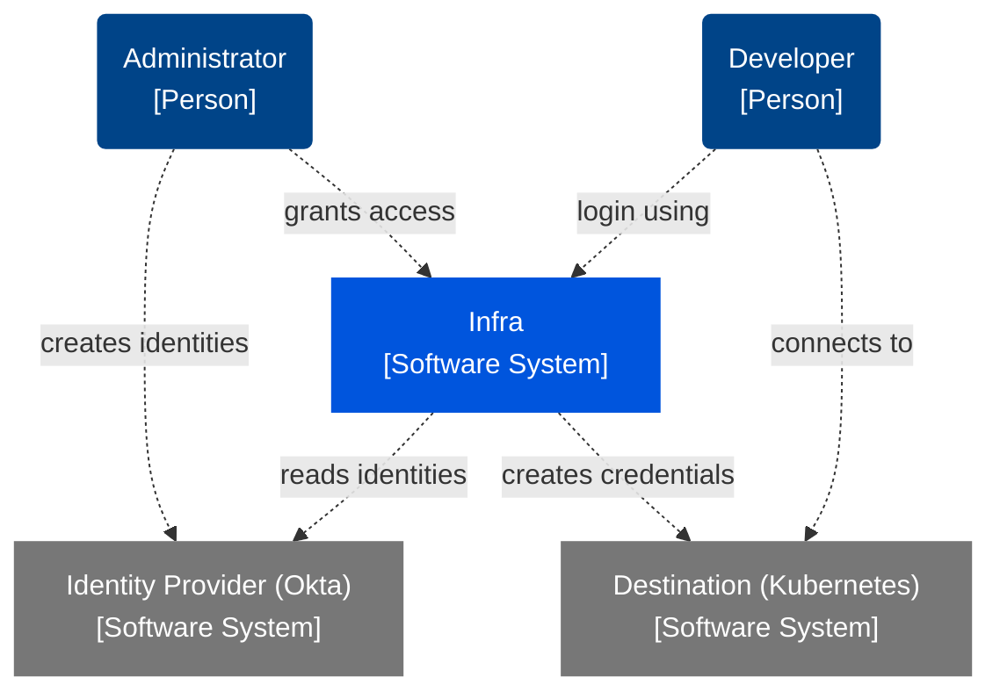

# Architecture

This page documents the system and software architecture of Infra. It follows the
[C4 model] for documenting software systems.

[C4 model]: https://c4model.com/

## System Context

## Containers

