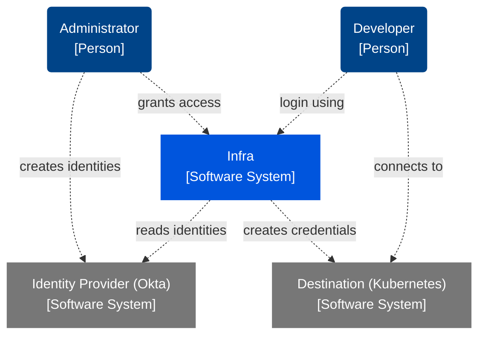
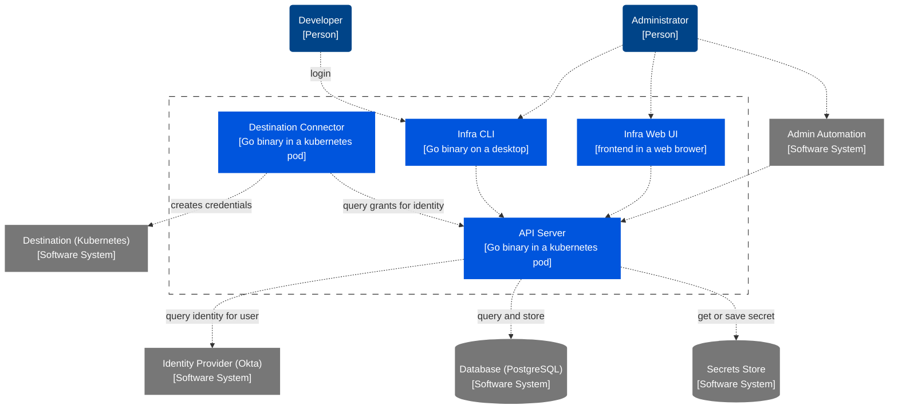
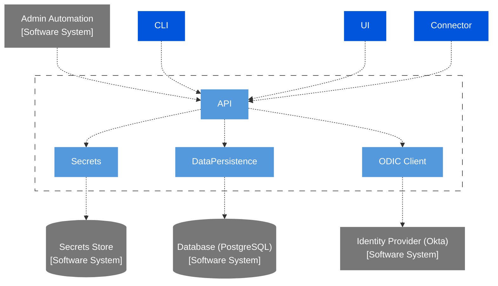
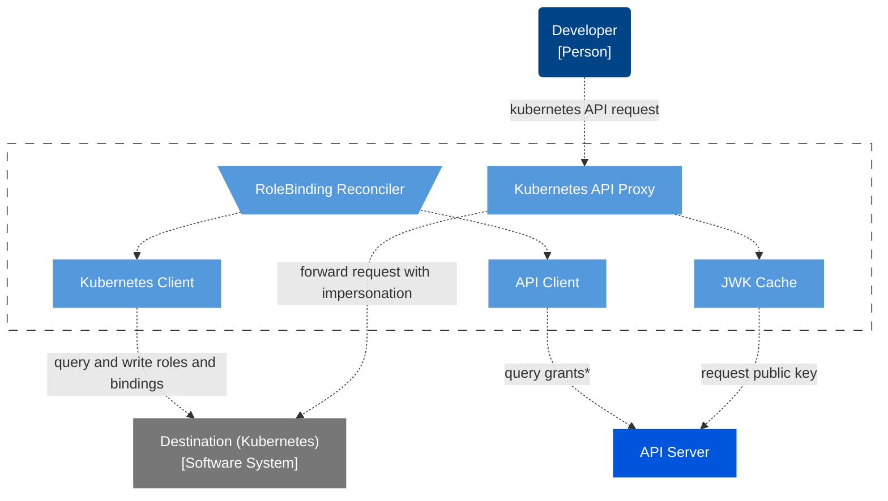
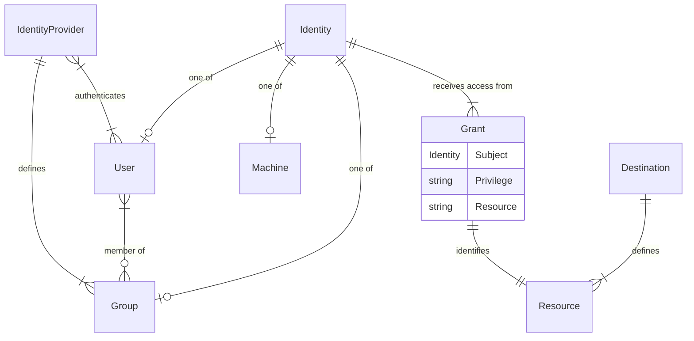

# Architecture

This page documents the system and software architecture of Infra. It follows the
[C4 model] for documenting software systems.

[C4 model]: https://c4model.com/

## System Context

The system context shows how users, Infra, and external systems interact.

## Infra Containers

The Infra system is comprised of 4 containers.

### API Server

### Destination Connector

### Command Line Interface (CLI)

### Web UI

## Code

### Grant Entities

